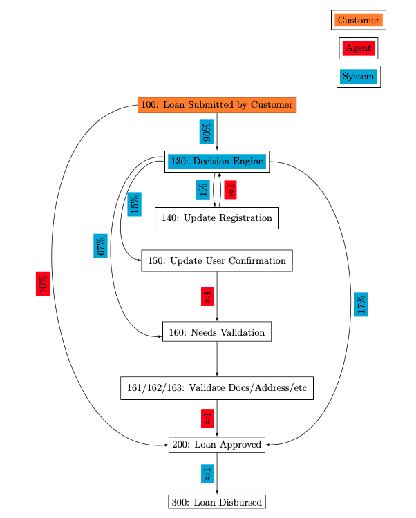
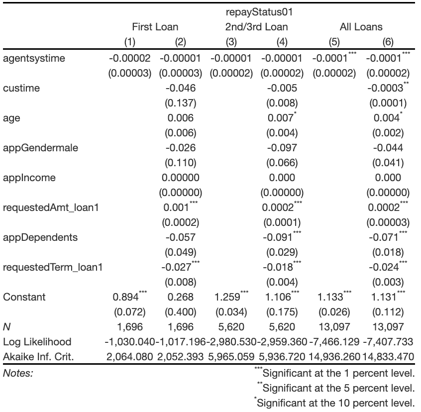
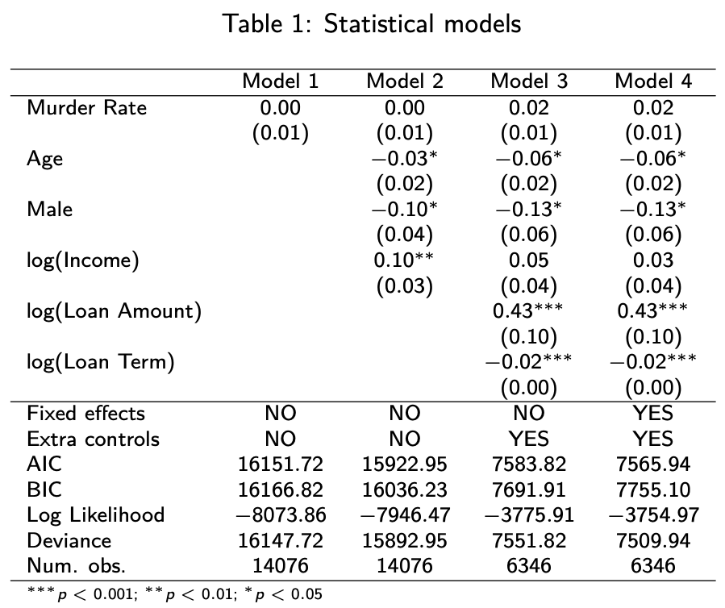
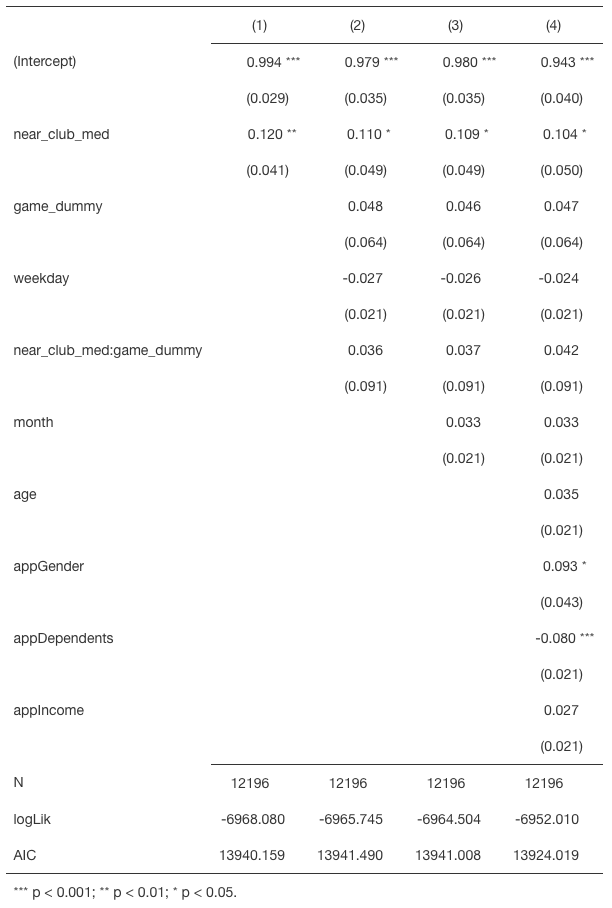
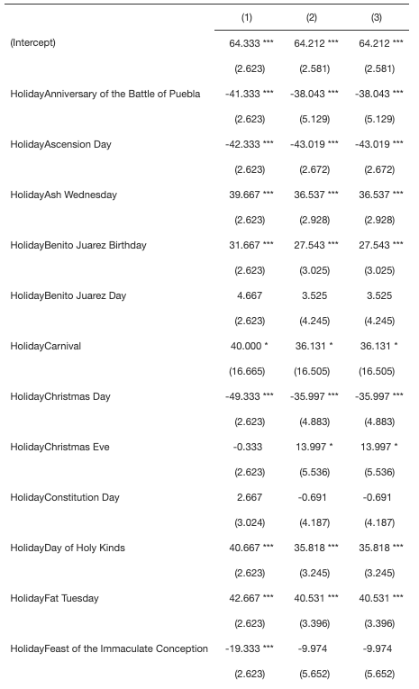
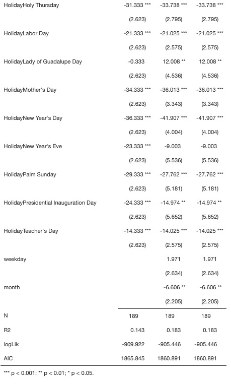
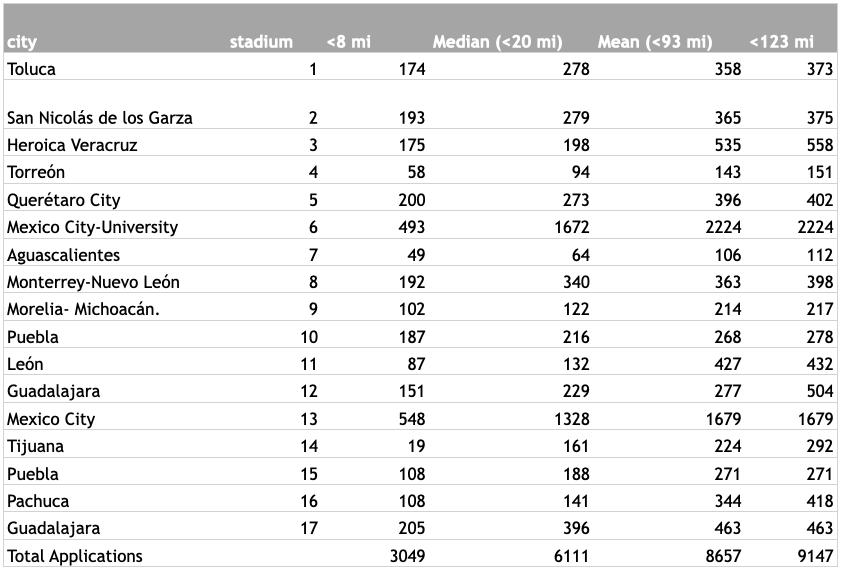

class: inverse, middle

```{R, setup, include = F}
# devtools::install_github("dill/emoGG")
library(pacman)
p_load(
  broom, tidyverse,
  ggplot2, ggthemes, ggforce, ggridges,
  latex2exp, viridis, extrafont, gridExtra,
  kableExtra, snakecase, janitor,
  lubridate, knitr,
  estimatr, here, magrittr, pagedown
  ,readxl,tidyr,ggplot2,xtable,data.table,
   graphics,lubridate,fasttime,knitr,finalfit,kableExtra,dplyr
  )

# Define pink color
red_pink <- "#e64173"
turquoise <- "#20B2AA"
orange <- "#FFA500"
red <- "#fb6107"
blue <- "#2b59c3"
green <- "#8bb174"
grey_light <- "grey70"
grey_mid <- "grey50"
grey_dark <- "grey20"
purple <- "#6A5ACD"
slate <- "#314f4f"
# Dark slate grey: #314f4f
# Knitr options
opts_chunk$set(
  comment = "#>",
  fig.align = "center",
  fig.height = 7,
  fig.width = 10.5,
  warning = F,
  message = F
)
opts_chunk$set(dev = "svg")
options(device = function(file, width, height) {
  svg(tempfile(), width = width, height = height)
})
options(crayon.enabled = F)
options(knitr.table.format = "html")

```

```{css, echo = F, eval = F}
@media print {
  .has-continuation {
    display: block !important;
  }
}
```

```{r brock, echo = F}
cleaned_df = read.csv("data/cleaned_df_brock.csv")
LoanSteps1 = cleaned_df

#I created a new variable: applicant ID + Loan Number bc each applicant may have multiple loans and the time between steps may become distorted if grouping by a single applicant ID
LoanSteps1$applicantIDLoanNumber = paste(as.character(LoanSteps1$applicantID),as.character(LoanSteps1$LoanNumber))
#I add 14 lag events to see the path of a given loan: e.g. if lag event 1 = 130, lag event 2 = 100, lag event 3 = 100, starting state = 130 and finishing state = 160, then the loan went from 100->100->130->160
#Definitely need a better method here (maybe a loop?)

LoanSteps1 %<>% 
  group_by(applicantIDLoanNumber) %>% 
  arrange(created_at) %>% 
  mutate(lagevent1 = lag(starting_state, n = 1)) %>%
  mutate(lagevent2 = lag(starting_state, n = 2)) %>%
  mutate(lagevent3 = lag(starting_state, n = 3)) %>%
  mutate(lagevent4 = lag(starting_state, n = 4)) %>%
  mutate(lagevent5 = lag(starting_state, n = 5)) %>%
  mutate(lagevent6 = lag(starting_state, n = 6)) %>%
  mutate(lagevent7 = lag(starting_state, n = 7)) %>%
  mutate(lagevent8 = lag(starting_state, n = 8)) %>%
  mutate(lagevent9 = lag(starting_state, n = 9)) %>%
  mutate(lagevent10 = lag(starting_state, n = 10)) %>%
  mutate(lagevent11 = lag(starting_state, n = 11)) %>%
  mutate(lagevent12 = lag(starting_state, n = 12)) %>%
  mutate(lagevent13 = lag(starting_state, n = 13)) %>%
  mutate(lagevent14 = lag(starting_state, n = 14)) %>%
  ungroup()

LoanSteps1$totaleventprocess = paste(as.character(LoanSteps1$finishing_state),
                                     as.character(LoanSteps1$starting_state),
                                     as.character(LoanSteps1$lagevent1),
                                     as.character(LoanSteps1$lagevent2),
                                     as.character(LoanSteps1$lagevent3),
                                     as.character(LoanSteps1$lagevent4),
                                     as.character(LoanSteps1$lagevent5),
                                     as.character(LoanSteps1$lagevent6),
                                     as.character(LoanSteps1$lagevent7),
                                     as.character(LoanSteps1$lagevent8),
                                     as.character(LoanSteps1$lagevent9),
                                     as.character(LoanSteps1$lagevent10),
                                     as.character(LoanSteps1$lagevent11),
                                     as.character(LoanSteps1$lagevent12),
                                     as.character(LoanSteps1$lagevent13),
                                     as.character(LoanSteps1$lagevent14))

#it seems that the process: 300 200 163 162 161 160 130 100 100 NA NA NA NA NA NA NA with count:1513 is the highest completed process with end state 300
#View(sort(table(LoanSteps1$totaleventprocess)))

LoanSteps1 %<>% 
  group_by(applicantIDLoanNumber) %>% 
  arrange(created_at) %>% 
  mutate(totaltime = sum(diff_min, na.rm = T)) %>%
  ungroup()

LoanSteps1 %<>% 
  group_by(applicantIDLoanNumber) %>% 
  mutate(custime = sum(diff_min[(maker_user_type == "CUSTOMER")])) %>%
  ungroup()

LoanSteps1 %<>% 
  group_by(applicantIDLoanNumber) %>% 
  mutate(agentsystime1 = sum(diff_min[!(maker_user_type == "CUSTOMER")])) %>%
  ungroup()

LoanSteps1 %<>% 
  group_by(applicantIDLoanNumber) %>% 
  mutate(agentsystime = totaltime - custime) %>%
  ungroup()

LoanSteps1$agentsystime2 = rowSums(data.frame(LoanSteps1$agentsystime, LoanSteps1$agentsystime1), na.rm = TRUE)

LoanSteps1 %<>% 
  group_by(applicantIDLoanNumber) %>% 
  mutate(custime1 = totaltime - agentsystime2) %>%
  ungroup()

##############Further analysis of pathways##############

LoanSteps2 = LoanSteps1
LoanSteps2 %<>% 
  group_by(applicantIDLoanNumber) %>% 
  arrange(created_at) %>% 
  filter(row_number() > (n() - 1)) %>%
  ungroup()


a121 = data.frame(sort(table(LoanSteps2$totaleventprocess), decreasing = TRUE))
a121$Var2 = sub("NA", "" , a121$Var1)
for (i in (1:14)){
a121$Var2 = sub("NA", "" , a121$Var2)
}

a121$Frequency = a121$Freq
a121$Percent = round(a121$Frequency/sum(a121$Frequency), digits = 2)*100
#colnames(a121)
colnames(a121)[3] = "Pathway"
slide2_left <- kable(head(a121[,3:5], 10)) #%>% kable_classic(full_width = F, html_font = "Cambria")


# Graph of Pathways
p <- ggplot(a121, aes(x=1, y=Frequency, fill=Pathway)) +
  geom_bar(stat="identity") +
  theme(  legend.title = element_blank()
        , legend.position = "none"
        , axis.text.x = element_blank()
        , axis.text.y = element_blank()
        , axis.ticks = element_blank()
        , panel.background = element_rect(fill = '#fafafa')
        , plot.background = element_rect(fill = '#fafafa')
        , panel.border = element_blank()
        , panel.grid.major = element_blank()
        , panel.grid.minor = element_blank()
        , plot.title = element_text(hjust = 0.5,size = 20)
        , aspect.ratio = 1
        ) +
  labs(title = "Frequency of Loan Pathways"
       ,x = element_blank()
       ,y = element_blank())+
  coord_polar(theta='y')
#+scale_fill_viridis_d()


########################### Pathway analysis ###############

LoanSteps2 = LoanSteps1
LoanSteps2$Transition = paste(as.character(LoanSteps2$starting_state),"-", as.character(LoanSteps2$finishing_state))
Pathways = data.frame(table(LoanSteps2$Transition))

Pathways=Pathways[-c(4,5,6,9, 13, 14, 30, 34, 36, 38, 39, 40, 41), ]
# Pathways

########################### Pathway analysis ###############
LoanSteps2 = LoanSteps1
LoanSteps2$Transition = paste(as.character(LoanSteps2$starting_state),"-", as.character(LoanSteps2$finishing_state))
Pathways = data.frame(table(LoanSteps2$Transition))

Pathways=Pathways[-c(4,5,6,9, 13, 14, 30, 34, 36, 38, 39, 40, 41), ]
LoanSteps2 = LoanSteps2[!(is.na(LoanSteps2$diff_min)),]

G = LoanSteps2 %>% 
  group_by(Transition) %>% 
  select(diff_min) %>%
  summarise_each(funs(min = min, 
                      q25 = quantile(., 0.25), 
                      median = median, 
                      q75 = quantile(., 0.75), 
                      max = max,
                      mean = mean, 
                      sd = sd)) %>%
  data.frame()

G[,2:ncol(G)] = round(G[,2:ncol(G)], 2)
G = na.omit(G)
G=G[20:30, ]


#xtable((G))
```

# What are the drivers of application and repayment of digital credit?  

---
# Loan Pathways and Durations  

.pull-left[
```{r flow, echo = F}

```
]  

.pull-right[
```{r g, echo=F} 
G %>%  
  kable(row.names = F) %>% 
  #kable_classic(full_width = F, html_font = "Cambria") %>%
  kable_styling(font_size = 12, bootstrap_options = c("striped", "hover", "condensed"))
```
]


---
# Frequency of Loan Pathways
.pull-left[
```{r s2l,echo=F}
slide2_left %>%
  kable_styling(font_size = 12, bootstrap_options = c("striped", "hover", "condensed"))
```
]
.pull-right[
```{r s2r,echo=F}
print(p)
```
]

---
# "Perfect" Loan Repayment Analysis
```{r pla, echo = F, out.height="60%", out.width="60%"}

```  
  
---
class: inverse, middle
# Agent response hours
  
---
# Agents only respond during work hours

```{r agent, echo = F}
# Importing cleaned_df table
cleaned_df_e <-read_csv("data/cleaned_df.csv")
cleaned_df_e %<>% rename(  firstAgentEvent = `firstAgentEvent    `
                         , lastAgentEvent =`lastAgentEvent     `
                         , curDueDt = `curDueDt  `
                         )

# I was using loan_d_m1, renaming some columns, taking only useful ones
loan_d_m1 <- cleaned_df_e %>%
              mutate(  created_atMX = ymd_hms(created_at_2)
                     , created_atMX_dt = date(created_atMX)
                    ) %>%
              select(  applicantID
                     , clientID
                     , created_atMX
                     , created_atMX_dt
                     , created_at
                     , starting_state
                     , finishing_state
                     , maker_user_type
                     , transition_event
                     , transition_event_detail
                     , appSubmitTimeMX
                     , firstAgentEvent
                     , lastAgentEvent
                     , loanDisbursalTimeMX
                     , curDueDt
                     , finalRepayDt
                     , repayStatus
                     , loan_status_id
                     , delinqDays
                     , loan_sequence
                     , addrZip
                     , addrCity
                     , age
                     , appGender
                     , appCivilStatus
                     , appDependents
                     , appIncome
                     , requestedAmt_loan1
                     , requestedTerm_loan1
                     , actualAmt_loan1
                     , actualTerm_loan1
                     , scoreProxy
                    # , Place.Name
                    # , State
                    # , State.Abbreviation
                    # , Latitude
                    # , Longtiude
                     )

# Don't need cleaned_df anymore
rm(cleaned_df_e)

last_agent_act <- loan_d_m1 %>% 
  filter(maker_user_type == 'AGENT')%>%
  group_by(created_atMX_dt) %>%
  summarize(last_agent_event = max(created_atMX)) %>%
  mutate( created_at_dow = lubridate::wday(created_atMX_dt,label = T)
          , last_agent_event_hms = hms::as_hms(last_agent_event)
  )

# Plotting density of last agent event by day of week
ggplot(last_agent_act,aes(  y= fct_rev(created_at_dow)
                            , x=last_agent_event_hms
                            , group = created_at_dow
                            , fill = created_at_dow
)
) +
  geom_density_ridges(alpha = 0.7) + 
  labs(  x = "Last Agent Response Time"
         , y = "Day of Week"
         , title = "Last Agent Event by Day of Week") +
  theme_pander(base_size = 16) +
  scale_fill_viridis_d()

```

---
# However, increased time has no effect
```{r rd, echo = F}

loan_steps_ranked <- loan_d_m1 %>% 
    # Removing extra rows that don't change the state
    filter( starting_state != finishing_state) %>%
    arrange(created_atMX) %>%
    group_by(applicantID,clientID) %>%
    mutate(actv_rank = row_number())

loan_next_step <- loan_steps_ranked %>% 
                    mutate(  created_atMX_n = created_atMX
                           , actv_rank_m1 = actv_rank - 1
                           , transition_event_n = transition_event
                           , starting_state_n = starting_state
                           , finishing_state_n = finishing_state
                           , maker_user_type_n = maker_user_type
                          ) %>%
                    select(  applicantID
                           , clientID
                           , created_atMX_n
                           , actv_rank_m1
                           , transition_event_n
                           , starting_state_n
                           , finishing_state_n
                           , maker_user_type_n
                           )
loan_steps_time <- loan_steps_ranked %>% 
  inner_join(loan_next_step,by=c("applicantID"="applicantID","actv_rank"="actv_rank_m1")) %>%
  mutate (  step_secs = difftime(created_atMX_n, created_atMX, units="secs") %>% as.numeric()
          , exog_secs = if_else(  transition_event %in% c(10002,13002,13003,13005,13006,13007,10004)
                                , step_secs
                                , 0
                                ) 
          , in_mx_ts = created_atMX
          , out_mx_ts = created_atMX_n
          , same_day_resp = if_else(date(in_mx_ts)==date(out_mx_ts),1,0)
          , wait_on_agent = if_else(maker_user_type %in% c("CUSTOMER","SYSTEM") & maker_user_type_n == "AGENT",1,0)
          , in_mx_dt = date(in_mx_ts)
          , out_mx_dt = date(out_mx_ts)
          , tot_time = difftime(loanDisbursalTimeMX, appSubmitTimeMX, units = "secs") %>% as.numeric()
          , late_flag = if_else(delinqDays > 0, 1, 0 )
          ) %>% 
  inner_join(last_agent_act, by = c("in_mx_dt"="created_atMX_dt")) %>%
  mutate(time_from_agent_stop = as.numeric(difftime(in_mx_ts,last_agent_event,units = "secs"))) %>%
  select(  applicantID
         , clientID.x
         , in_mx_ts 
         , out_mx_ts
         , starting_state # Previous state
         , finishing_state # During state
         , finishing_state_n # Next State
         , transition_event
         , transition_event_n
         , maker_user_type
         , maker_user_type_n
         , actv_rank
         , step_secs
         , exog_secs
         , tot_time
         , same_day_resp
         , wait_on_agent
         , in_mx_dt
         , out_mx_dt
         , last_agent_event
         , last_agent_event_hms
         , created_at_dow
         , time_from_agent_stop
         , appSubmitTimeMX
         , loanDisbursalTimeMX
         , curDueDt
         , finalRepayDt
         , repayStatus
         , loan_status_id
         , delinqDays
         , late_flag
         , loan_sequence
         )

loan_steps_time %<>% rename(  clientID = clientID.x
                            , prev_state = starting_state
                            , curr_state = finishing_state
                            , next_state = finishing_state_n
                            , in_event = transition_event
                            , out_event = transition_event_n
                            , in_user = maker_user_type
                            , out_user = maker_user_type_n
                            , day_of_week = created_at_dow
                           )


loan_steps_time %<>% mutate(abs_time_from_agent_stop = abs(time_from_agent_stop))

# Finding event closest to the agent quitting
loan_min <- loan_steps_time %>% 
  filter(in_event %in% c(13002,13003,15001)) %>%
  group_by(clientID,applicantID) %>%
  summarize(min_abs_time_from_agent_stop = min(abs_time_from_agent_stop))

# Checking to make sure I wont accidentally duplicate rows
# (Dont have two steps with exactly matching time_from_agent_stop)
#loan_steps_time %>% 
#  filter(in_event %in% c(13002,13003,15001)) %>%
#  group_by(clientID,applicantID) %>%
#  summarize(tot_count = n()
#            ,dedup_count = n_distinct(abs_time_from_agent_stop)) %>%
#  filter(tot_count != dedup_count)
  
  
# Take closest one to agent cutoff, find THAT step's length
loan_flag <- loan_min %>% 
  inner_join(  loan_steps_time %>% filter(in_event %in% c(13002,13003,15001))
             , by = c(  "applicantID"="applicantID"
                      , "clientID"="clientID"
                      , "min_abs_time_from_agent_stop"="abs_time_from_agent_stop"
                     )
            ) %>%
  # WINSORIZING and Removing loans we don't have outcome data for (not many of them) 
  filter(  !is.na(tot_time)) %>%
  filter( tot_time <= quantile(tot_time,0.9))

bin_min <- 10
wid_min <- 120


# Creating the bins
same_day_loan <- loan_flag %>%
  mutate( time_from_agent_stop_bin = ceiling(time_from_agent_stop/(60*bin_min))) %>%
  group_by(time_from_agent_stop_bin) %>%
  summarize(  pr_same_day_resp = mean(same_day_resp)
            , num_obs = n()
            , avg_step_time = mean(step_secs/(60*bin_min), na.rm = T)
            , avg_tot_time = mean(tot_time/(60*bin_min), na.rm = T)
            , pr_late = mean(late_flag, na.rm=T)
          )
```
.pull-left[
```{r rd1 ,echo =F}
ggplot(same_day_loan, aes( x = time_from_agent_stop_bin, y = pr_same_day_resp)) +
  geom_point()+
  geom_vline(xintercept = 0, color = red_pink, size = 1) +
  theme_pander(base_size = 16) +
 labs(  title = "Probability of Same Day Response"
         , x = paste(toString(bin_min), "mins from Agent Stop")
         , y = "Pr Same Day Resp"
  ) +
  xlim(-wid_min/bin_min, wid_min/bin_min)
#  facet_wrap(~in_event)

# Step time
ggplot(same_day_loan, aes( x = time_from_agent_stop_bin, y = avg_step_time)) +
  geom_point()+
  geom_vline(xintercept = 0, color = red_pink, size = 1) +
  theme_pander(base_size = 16) +
  labs(  title = "Avg Time to Agent Response"
         , x = paste(toString(bin_min), "mins from Agent Stop")
         , y = paste(toString(bin_min), "mins to Agent Response")
  ) +
  xlim(-wid_min/bin_min, wid_min/bin_min) +
  ylim(0,300)
#  facet_wrap(~in_event)
```
]
.pull-right[
``` {r rd2,echo = F}
# Total time
ggplot(same_day_loan, aes( x = time_from_agent_stop_bin, y = avg_tot_time)) +
  geom_point()+
  geom_vline(xintercept = 0, color = red_pink, size = 1) +
  theme_pander(base_size = 16) +
  labs(  title = "Loan Submit to Disbursal Time"
         , x = paste(toString(bin_min), "mins from Agent Stop")
         , y = "Total Time"
  ) +
  xlim(-wid_min/bin_min, wid_min/bin_min) +
  ylim(0,350)
#  facet_wrap(~in_event)

# Default rate
ggplot(same_day_loan, aes( x = time_from_agent_stop_bin, y = pr_late)) +
  geom_point()+
  geom_vline(xintercept = 0, color = red_pink, size = 1) +
  theme_pander(base_size = 16) +
  labs(  title = "Probability of Default"
         , x = paste(toString(bin_min), "mins from Agent Stop")
         , y = "Pr Late"
  ) +
  xlim(-wid_min/bin_min, wid_min/bin_min)

```
]

---
class: inverse, middle
# Effect of Murder Rate

---
# Murder Rate Summary Statistics

```{r results = "asis", warning = FALSE, fig.width=20, fig.height=10, echo=FALSE, message = FALSE}

p_load(ggplot2, ggthemes, dplyr, tidyverse, lubridate,arsenal,kableExtra,zoo,knitr, stringr)

analysis_data <- read.csv("data/analysis_data.csv", fileEncoding = "latin1")
analysis_data$loan_sequence = factor(analysis_data$loan_sequence)

mylabels <- list( 
                   actualAmt_loan1 ="Actual Loan Amount",
                   actualTerm_loan1 = "Actual Loan Term",
                   requestedAmt_loan1 = "Requested Loan Amount",
                   requestedTerm_loan1 = "Requested Loan Term",
                   appIncome = "Income",
                   appDependents = "Number of Dependents",
                   murder_rate.x = "Murder Rate by State",
                   murder_rate.y = "Murder Rate by Municipal",
                   appGender = "Gender",
                   appCivilStatus = "Civil Status",
                   loan_sequence = "Loan Sequence",
                   scoreProxy = "Credit Score"
                   )
table = tableby(repayStatus ~ appIncome+ 
                             requestedAmt_loan1 + requestedTerm_loan1 + actualAmt_loan1 + actualTerm_loan1 +
                            murder_rate.x + murder_rate.y + 
                            appDependents +
                            appGender + 
                            appCivilStatus+
                            loan_sequence +
                            scoreProxy, data = analysis_data)

summary_table = summary(table, title = "Descriptive Statistics on Borrower's Characterstics", labelTranslations = mylabels)
 a = as.data.frame(summary_table)
 a[,1]=str_replace(a[,1], "&nbsp;&nbsp;&nbsp;", "")

 names(a)[1] = "Classification"
 
b =  a[23:43,]
rownames(b) = NULL

p_load(miceadds,texreg)


analysis_data <- read.csv("data/analysis_data.csv",fileEncoding = "latin1")

analysis_data$date = as.yearmon(paste(analysis_data$year.x, analysis_data$month.x), "%Y %m")
reg_f1 = glm.cluster(data = analysis_data, 
                            repayStatusDummy ~ murder_rate.y, 
                     family = "binomial", cluster = "clientID")

reg_f2 = glm.cluster(analysis_data, 
                     repayStatusDummy ~ murder_rate.y + log(population.y) + age + 
                     I(age^2)+ factor(appGender) + factor(appCivilStatus) + 
                     log(appIncome) + appDependents+ factor(scoreProxy),
               family=binomial, cluster = "clientID")
reg_f3 = glm.cluster(analysis_data %>% filter(loan_sequence ==1), repayStatusDummy ~ murder_rate.y + log(population.y) +
               age + I(age^2)+ factor(appGender) + factor(appCivilStatus) + log(appIncome) + appDependents+ factor(scoreProxy) +
               log(requestedAmt_loan1) + requestedTerm_loan1, 
             family=binomial, cluster = "clientID")

reg_f4 = glm.cluster(analysis_data %>% filter(loan_sequence ==1), repayStatusDummy ~ murder_rate.y + log(population.y) +
               age + I(age^2)+ factor(appGender) + factor(appCivilStatus) + log(appIncome) + appDependents+ factor(scoreProxy) +
               log(requestedAmt_loan1) + requestedTerm_loan1+factor(month.y) +factor(wday(created_atMX)), 
               family =binomial, cluster="clientID")

reg_table=texreg(l = list(reg_f1, reg_f2, reg_f3, reg_f4), 
             custom.coef.map=list("murder_rate.y"="Murder Rate", "age" = "Age", 
                                  "factor(appGender)male" = "Male", 
                                  "log(appIncome)" = "log(Income)",
                                  "log(requestedAmt_loan1)"="log(Loan Amount)",
                                  "requestedTerm_loan1" = "log(Loan Term)"), 
                                  table=TRUE, use.packages=FALSE, caption.above = TRUE,
             fontsize = "scriptsize",
             custom.gof.rows=list("Fixed effects" = c("NO", "NO", "NO", "YES"),
                                  "Extra controls" = c("NO", "NO", "YES", "YES")))
```

```{r mr1, results='asis',fig.width=10, fig.height=5, echo=FALSE, message = FALSE} 
 knitr::kable(a[1:22,], digits = 0, align=rep('c', 2)) %>% 
  kable_styling(font_size = 8, bootstrap_options = c("striped", "hover", "condensed"))
#   kable_styling(latex_options=c("scale_down", "hold_position"))
 
```

---
# Murder Rate Summary Statistics (cont')

```{r results = "asis", warning = FALSE, fig.width=20, fig.height=10, echo=FALSE, message = FALSE}
knitr::kable(b, digits = 0, align=rep('c', 2)) %>% 
  kable_styling(font_size = 10, bootstrap_options = c("striped", "hover", "condensed"))
  #Kable_styling(latex_options=c("scale_down", "hold_position"))
```

---
# Murder Rate Regression

```{r echo=FALSE, warning=FALSE, message = FALSE, out.height="70%", out.width="70%"}

```


---
# Effect of Murder Rate over time

```{r cars, echo = FALSE, warning = FALSE}
ts_2 <- read.csv("data/ts_2.csv")
ts_2$date = as.yearmon(paste(ts_2$year.x, ts_2$month.x), "%Y %m")

plot <- ggplot() + 
  geom_boxplot(data = analysis_data, mapping = aes(x =  as.factor(date), y =murder_rate.y), na.rm=TRUE) +
  stat_summary(data = analysis_data, mapping = aes(x =  as.factor(date), y =murder_rate.y, group=1), fun=mean, geom="line", color="blue", size=1)+
  stat_summary(data = analysis_data, mapping = aes(x =  as.factor(date), y =murder_rate.y), fun=mean, geom="point", color = "blue", size = 2) +
  geom_line(data = ts_2, mapping = aes(x = as.factor(date), y = log(starting_state_count)/3, group=starting_state), color="red", size=1) +
  geom_point(data = ts_2, mapping = aes(x = as.factor(date), y = log(starting_state_count)/3, group=starting_state), color="red", size=2)+
  ylab("Murder Rate | Log(Number of Applications)/3")+ ylim(0,5) +
  xlab("Date") + theme_classic()
plot+theme(axis.text=element_text(size=15),
        axis.title=element_text(size=17,face="bold"))

```
---
class: inverse, middle
# Effect of soccer games and holidays

---
# Futbol: Is Liga MX affecting borrowing?

```{r setup_tami, echo=F}
p_load(readxl
,plyr
,tidyverse
,lubridate
,magrittr
,ggplot2
#,plyr screw this package
,tidyr
,gghighlight
,usethis
,devtools
,pander
,GGally
,lattice
,jtools
,huxtable
,readxl
,gganimate #Need this for animted graph
,flextable)

holiday_df <- read_csv("data/holiday_df.csv")
holiday_highlvl <- read_csv("data/holiday_highlvl.csv")
agent_df <- read_csv("data/agent_df.csv")
holiday_df=holiday_df[-c(1)]
holiday_highlvl=holiday_highlvl[-c(1)]
agent_df=agent_df[-c(1)]
```
.pull-left[
```{r ani, echo = F}
include_graphics('data/map.gif')
```
- Evaluated locations near LIGA MX stadiums (8-100 mi radius)
  + Looked at probability of applying on gamedays for all agents, near and far away from stadiums  
  + Looked at probability of paying back loans on gameday applications  
]
.pull-right[
- Regression Results:  
  + Mexico City shares three teams, in which two use the same stadium.  
  + Assumption of distance to stadium might cause other issues not controlled for.  
- Further analysis needed:  
  + Find data that includes preferred team for each agent  
  + Look at data with applications from May-September (soccer off-season) => may potentially be a diff-in-diff  
  + Evaluate lagged effects: if a team loses -> did they apply the next day?  
]
---
# Futbol Regression Results
```{r fut_reg, echo = F, out.width="40%", out.height="40%"}

```

---

# Holidays: Is there something there? 
.pull-left[
```{r  warning=FALSE, message = FALSE, echo = F}
#Increase probability of paying back loans 
holiday_highlvl  %>% 
  ggplot(aes(x =app_date, y = applicantID, color = as.factor(holiday_dummy)), stat="count", na.rm=TRUE) + 
  geom_point(alpha=0.3)  + 
  geom_smooth()+
  xlab("Application Date")+
  ylab("Number of Applications") +
  labs(title = "Loan Applications for Holidays vs Non-Holidays"
      , color = "Holiday Indicator")+
  theme_pander(base_size = 16)

```
- Holidays/festivals might explain the increase application count  
- Put together a list of observed and national holidays  
]
.pull-right[
- Applications peak on March 20  
- Statistical significant results from regressing number of applications on Holidays, fixing weekday and month:  
  - Ascension day, Christmas, Benito Juarez Day, New Years, Mother’s Day, and Constitution Day  
  - Carnival was not significant after included FE  
- Further Analysis:  
  - Look at lag effects from holidays for a more robust evaluation of the impact of holidays such as Carnival  
]

---
# Holiday Regression Results  
.pull-left[
```{r fut_reg1, echo = F, out.width="80%", out.height="80%"}

```
]
.pull-right[
```{r fut_reg2, echo = F, out.width="80%", out.height="80%"}

```
]


---

class: inverse, middle  
# Questions?

---
# Locations of Soccer Games
.pull-left[
```{r socloc, echo = F}
agent_df %>%
                ggplot()  +
                geom_point(aes(Longtiude, Latitude, color=as.factor(near_club_med)))+
                labs(x = "Longitude", y = "Latitude") 
```
]
.pull-right[
```{r socloc2, echo = F}

```
]